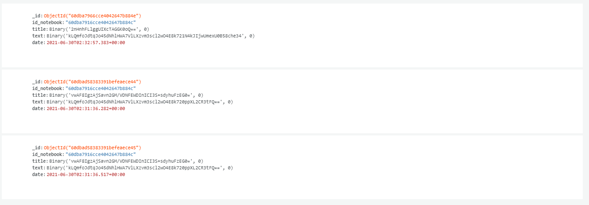

# Приложение заметки

## О приложении
Evernote на минималкал

Заметки в формате: Блокнот -> Заметки

## О реализации
Ui создан с помощью Qt Design исходники файла .ui к сожалению были на веки утеряны, но хоть 
успел скомпилировать в .py

Сейчас я понимаю, что использовать Qt Design Studio было бы, наверное куда практичней, но 
кто б сказал мне в начале разработки. 

Блокноты и заметки пользователей лежат в БД в зашифрованном виде. При первом запуске 
создаётся токен пользователя и ключ шифрования. Токен по возможности берётся с железок машины,
а ключ всегда генерируется рандомно. Так я получаю шифрование данных пользователей 
и аналог авторизации.

Так выглядят заметки в БД:

## Get Started
- Устанавливаем все модули из requirements.txt
- Создаём config.py по примеру (config_example.py) и заполняем, там только ссылка на подключение к MongoDB
- Запускаем main.py

